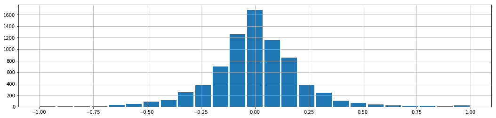

# **Behavioral Cloning** 

---

**Behavioral Cloning Project**

The goals / steps of this project are the following:
* Use the simulator to collect data of good driving behavior
* Build, a convolution neural network in Keras that predicts steering angles from images
* Train and validate the model with a training and validation set
* Test that the model successfully drives around track one without leaving the road
* Summarize the results with a written report

## Rubric Points
### Here I will consider the [rubric points](https://review.udacity.com/#!/rubrics/432/view) individually and describe how I addressed each point in my implementation.  

---

### Files Submitted & Code Quality

#### 1. Submission includes all required files and can be used to run the simulator in autonomous mode

My project includes the following files:
* model.py containing the script to create and train the model
* drive.py for driving the car in autonomous mode
* model.h5 containing a trained convolution neural network
* writeup_report.md or writeup_report.pdf summarizing the results

#### 2. Submission includes functional code
Using the Udacity provided simulator and my drive.py file, the car can be driven autonomously around the track by executing
```sh
python drive.py model.h5
```

#### 3. Submission code is usable and readable

The model.py file contains the code for training and saving the convolution neural network. The file shows the pipeline I used for training and validating the model, and it contains comments to explain how the code works.

### Model Architecture and Training Strategy

#### 1. An appropriate model architecture has been employed

My model was inspired by the model developed by nVIDIA for the same task (https://devblogs.nvidia.com/parallelforall/deep-learning-self-driving-cars/).

Three sections can be identified:
 1. Preprocessing (model.py lines 91-92): crops the image (70 pixels above and 24 below) and changes the color space into YUV (see https://en.wikipedia.org/wiki/YUV#Conversion_to/from_RGB). I introduce a bias of -0.5 in the Y channel in order to have simmetrical inputs.
 2. Convolutions (model.py lines 94-100): 5 convolutional layers separated by non-linear activation functions. I chose exponential linear units (ELUs) as main activation functions because they alleviate the vanishing gradient problem while pushing the mean activation toward zero (see https://arxiv.org/abs/1511.07289). Only for the first layer I adopted a CReLU (model.py line 95), because it has been shown that the first convolutional layer usually learns *complementary* features (see https://arxiv.org/abs/1603.05201). As a consequence, the number of channels of the first layer has been halved w.r.t. the original nVIDIA implementation.
 3. Top (model.py lines 102-107): a dense MLP built on top of the last, flattened convolutional layer. I inserted a dropout layer (with 0.5 probability) just before the flattening in order to reduce the probability of overfitting the training data. Again, I put ELUs activation functions between layers, while I used a softsign activation function (model.py line 107) as final output in order to have values between -1 and 1. This helped to reduce the incidence of *saturating* the steering.

#### 2. Attempts to reduce overfitting in the model

The model contains dropout layers in order to reduce overfitting (model.py lines 100).

The model was trained and validated on different data sets to ensure that the model was not overfitting (code lines 175 and 193). The model was tested by running it through the simulator and ensuring that the vehicle could stay on the track.

#### 3. Model parameter tuning

The model used an adam optimizer, so the learning rate was not tuned manually (model.py line 86).

#### 4. Appropriate training data

Training data was chosen to keep the vehicle driving on the road. I created different subdatasets to take into account different issues:
 1. Two laps of center lane driving.
 2. Two laps of center lane driving in the reverse direction.
 3. One lap of recovering from left and right side (i.e. go to a lane side, start recording, drive to the lane center, stop recording and repeat).
 4. Six bridge crossings (three in one way, three in the other one), because the model showed low performance on it.

I also used the training dataset made available by Udacity (https://d17h27t6h515a5.cloudfront.net/topher/2016/December/584f6edd_data/data.zip).

### Model Architecture and Training Strategy

#### 1. Solution Design Approach

At first I thought to only train a MLP on top of one of the networks already trained on ImageNet that Keras offers. Unfortunately, the size of the final network was usually too big also for AWS G2.x2large instances: I usually ended up with very small batches (2-4) and very long lasting epochs. The bottleneck was the first dense layer, as it had to connect to **every** "pixel" of the last convolutional layer, and sometimes even few hundreds were impractible.

Therefore I switched to nVIDIA model, that was much simpler but still has already shown to be able to perform the job. The only problem was that it was applied to YUV space, so I had to implement the conversion with Keras+Tensorflow. I kept the dense layer size I was already using as it seemed to me that the nVIDIA model cutted too early the number of neurons.

I decided to introduce some modifications to the model, because my training data was not very extensive and, although the validation error was always below the training error, tests *on the field* showed high overfitting. The main modifications were:
 1. Non-linear activation functions after convolutional layers (in particular, CReLU after the very first).
 2. Dropout layer between convolutional layers and flattening.

The final step was to run the simulator to see how well the car was driving around track one. The bridge was a critical point. Even if most of the the model was able to drive all the way through, when exiting the bridge it turned either left or right leaving the lane or stucking into the wall. To overcome this issue I recorded some more training data explicitly taken on the bridge, in both the directions. This permitted the model to learn how to deal properly with it.

At the end of the process, the vehicle is able to drive autonomously around the track without leaving the road. The driving is not perfectly straight, especially in some parts of the track, but it remains most of time roughly in the center of the lane and it never crosses the side lane lines.

#### 2. Final Model Architecture

The final model architecture (model.py lines 89-107) consisted of a convolution neural network with the following structure.

Layer (type)                  |   Output Shape        |  Param #   |  Connected to
:-----------------------------|-----------------------|------------|-----------------------------------
Cropping (Cropping2D)         |   (None, 66, 320, 3)  |  0         |  cropping2d_input_6[0][0]      
rgb2yuv (Lambda)              |   (None, 66, 320, 3)  |  0         |  Cropping[0][0]                
Conv1 (Convolution2D)         |   (None, 31, 158, 12) |  912       |  rgb2yuv[0][0]                 
CReLU (Lambda)                |   (None, 31, 158, 24) |  0         |  Conv1[0][0]                   
Conv2 (Convolution2D)         |   (None, 14, 77, 36)  |  21636     |  CReLU[0][0]                   
Conv3 (Convolution2D)         |   (None, 5, 37, 48)   |  43248     |  Conv2[0][0]                   
Conv4 (Convolution2D)         |   (None, 3, 35, 64)   |  27712     |  Conv3[0][0]                   
Conv5 (Convolution2D)         |   (None, 1, 33, 64)   |  36928     |  Conv4[0][0]                   
Dropout-0.5 (Dropout)         |   (None, 1, 33, 64)   |  0         |  Conv5[0][0]                   
Flatten (Flatten)             |   (None, 2112)        |  0         |  Dropout-0.5[0][0]             
Dense1 (Dense)                |   (None, 512)         |  1081856   |  Flatten[0][0]                 
Dense2 (Dense)                |   (None, 128)         |  65664     |  Dense1[0][0]                  
Dense3 (Dense)                |   (None, 32)          |  4128      |  Dense2[0][0]                  
Dense4 (Dense)                |   (None, 8)           |  264       |  Dense3[0][0]                  
Dense5 (Dense)                |   (None, 1)           |  9         |  Dense4[0][0]                  

#### 3. Creation of the Training Set & Training Process

To capture good driving behavior, I first recorded two laps on track one using center lane driving. Here is an example image of center lane driving:


I also recorded two laps running in the opposite direction, in order to balance the training dataset.

I then recorded the vehicle recovering from the left side and right sides of the road back to center so that the vehicle would learn to recovery errors. These images show what a recovery looks like starting from right:


I also had to record additional data on the bridge, because the model kept to have problems when exiting it.

To augment the dataset I implemented a Python generator to be used in conjuction with Keras *fit_generator*.
This generator, at each epoch, first randomly shuffle the dataset; then it performs the following steps:
 1. Take a batch
 2. Randomly select a camera (left, center, right)
 3. Randomly apply a shift image per image
 4. Randomly apply a rotation image per image
 5. Randomly apply a flip image per image
 6. Correct the steering angle accordingly to the performed distortions. Because it is too unnecessarly hard to exactly calculate the correction, I applied the following empirical rules:
    1. +/- 0.2 radians for left/right cameras resp.
    2. 0.002 radians for each horizontal (x) pixel of shift
    3. the same amount of rotation
    4. the sign is inverted when a flip is applied

The range of the random quantities can be chosen from the command line. I used up to 20px of shift and up to 10 degree of rotation.

Here are some examples of data augmentation.


Unfortunately I am not very good in driving the car with a pad or mouse, so I had to use the keyboard. This, together with the fact that there are not many bends in the track, had as drawback that most of the dataset is zero-steering. This can be easily seen in the following histogram:


In order to mitigate such drawback, I implemented the following strategies:
 1. Using Pandas, I easily averaged the steering on a temporal span of 150ms. In this way, steering is *softer* but long straight lanes are almost unaffected.
 2. I dropped a certain amount of zero-steering data, such that it was still dominant but not overwhelming, like in the following histogram 
 3. I integrated my training dataset with the one provided by Udacity (https://d17h27t6h515a5.cloudfront.net/topher/2016/December/584f6edd_data/data.zip)

The final histogram looks like the following


I finally randomly shuffled the data set and put 25% of the data into a validation set.

I exploited Keras callback ModelCheckpoint to retain the weights with highest validation score among epochs. In this way I could set a higher number of epochs without worrying of losing the obtained results. This showed that higher validation score does not necessarly mean better performance on the simulator. Models trained for a high number of epochs (e.g. 80) tend to be zigzag more than apparently slighly worst models trained for much less epochs (e.g. 15).  In my opinion, a better objective function (or at least validation metric) giving more insight in how well the model would perform on-the-field would be great, but I was not able to find it.

I used an adam optimizer so that manually training the learning rate wasn't necessary.

The following plot shows the MSE variation with the epochs:

